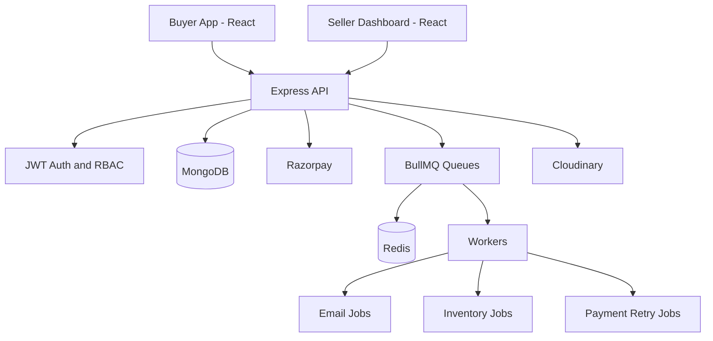

# TrustKart - E-commerce Marketplace

[](https://nodejs.org/)
[](https://www.mongodb.com/)
[](https://redis.io/)
[](https://react.dev/)

<!-- [](LICENSE) -->

TrustKart is a multi-tenant e-commerce marketplace with separate buyer and seller experiences, real-time inventory handling, secure Razorpay payments, OTP-gated registration and password reset, and event-driven background processing using BullMQ.

## 🚀 Live Project

| App              | URL                                         |
| ---------------- | ------------------------------------------- |
| Buyer App        | https://trustkart.saddamcodes.online        |
| Seller Dashboard | https://seller.trustkart.saddamcodes.online |

## ✨ Core Features

- **Async Job Processing**: BullMQ + Redis queues decouple I/O tasks (mail, inventory reconciliation, webhooks) from request/response cycles—eliminates blocking operations, handles 10k+ concurrent transactions.
- **Inventory Reservation System**: Atomic MongoDB operations with optimistic locking prevent overselling. Reservations auto-expire, triggering inventory release jobs via BullMQ.
- **Payment Retry Mechanism**: Failed payments can be retried within 15 minutes of initial attempt. Idempotent via unique order receipts and webhook deduplication.
- **Multi-tenant Seller Isolation**: JWT-based stateless auth + role-based access control. Each seller operates independently; shared backend handles all business logic.
- **OTP-Gated Registration**: Buyer and seller signup is a 2-step flow with email OTP verification before account creation.
- **Password Reset Flow**: Buyer and seller users can reset forgotten passwords using OTP email verification.
- **Real-time Razorpay Integration**: Webhook signature verification (HMAC-SHA256), automatic payment settlement, transaction idempotency tracking.
- **Optimized Media Pipeline**: Cloudinary auto-compression, responsive image transformation, reduces bandwidth by 60%+.
- **Rate Limiting & DDoS Protection**: Express middleware enforces per-IP request limits, protects endpoints from abuse.
- **Modular, Testable Architecture**: Clean separation of concerns (controllers → services → models) enables horizontal scaling, easy unit/integration testing.

## 📊 Tech Stack

| Layer           | Technology                              |
| --------------- | --------------------------------------- |
| Backend         | Node.js 18+, Express 5.1                |
| Database        | MongoDB 6.0+, Mongoose                  |
| Cache and Queue | Redis 7.0+, BullMQ 5.73                 |
| Frontend        | React 18+, Vite, Redux Toolkit          |
| Payments        | Razorpay with HMAC webhook verification |
| Media           | Cloudinary                              |
| Email           | Resend                                  |

## 🏗 Architecture



## 🔄 Core Workflows

#### 1️⃣ **Order → Payment → Fulfillment**

```
Buyer clicks "Buy"
    ↓
POST /api/orders
    ├─ Reserve inventory (BullMQ job)
    ├─ Create master order (DB)
    ├─ Generate Razorpay order
    └─ Return to client
    ↓
Client initiates payment via Razorpay SDK
    ↓
POST /api/payments/verify (client polls)
    ├─ Validate signature (HMAC-SHA256)
    ├─ Mark payment authorized
    └─ Extend reservation window
    ↓
Razorpay webhook: payment.captured
    ├─ Confirm inventory atomically (transaction)
    ├─ Create child orders per seller
    ├─ Trigger order confirmation email (BullMQ)
    └─ Release inventory reservation job
    ↓
Buyer receives confirmation email, order ready for fulfillment
```

#### 2️⃣ **Payment Failure & Retry**

```
Payment fails (network, declined, etc.)
    ↓
Razorpay webhook: payment.failed
    ├─ Update payment record (status: failed, reason logged)
    ├─ Keep reservation intact (buyer has 15 min to retry)
    └─ Queue retry reminder email
    ↓
Buyer: POST /api/payments/retry
    ├─ Validate: retry allowed? (within 15 min window)
    ├─ Generate new Razorpay order
    ├─ Update payment record (new razorpayOrderId)
    └─ Return new order ID to client
    ↓
Buyer retries payment
    ├─ Success → complete flow (step 1)
    └─ Failure → can retry again ( within 15 min window)
```

#### 3️⃣ **Inventory Management**

```
Order created
    ├─ Add reservation job to BullMQ (15 min TTL)
    └─ Decrement available stock atomically
    ↓
Payment captured
    ├─ Confirm inventory (reservation → sold)
    └─ Remove scheduled release job
    ↓
Reservation expires
    ├─ Release inventory (add back to stock)
    └─ Update seller dashboard in real-time
```

#### 4️⃣ **Password Reset**

```
Password reset requested
    ├─ Generate OTP and send via email
    └─ Store OTP with expiration (TTL)
    ↓
User verifies OTP
    ├─ Validate OTP and expiration
    └─ Issue secure reset token
    ↓
Password reset completed
    ├─ User submits new password
    ├─ Update password securely (hash)
    └─ Invalidate OTP and reset token
```

## 🚀 Setup

### Prerequisites

```text
Node.js 18+
MongoDB 6.0+
Redis 7.0+
Razorpay, Cloudinary, and Resend API keys
```

### Quick Start

```bash
git clone <repo>
cd e-commerce-marketplace

cd backend && npm install
cd ../client && npm install
cd ../seller && npm install

# Configure environment files in backend, client, and seller
cp .env.example .env

# Run each app in a separate terminal
cd backend && npm run dev
cd client && npm run dev
cd seller && npm run dev
```

### Local URLs

| Service          | URL                   |
| ---------------- | --------------------- |
| API              | http://localhost:5000 |
| Buyer App        | http://localhost:5173 |
| Seller Dashboard | http://localhost:5174 |

## Environment Variables

### Backend

```env
MONGODB_URI=mongodb://localhost:27017/ecommerce
REDIS_URL=redis://localhost:6379
JWT_SECRET=your-secret
RAZORPAY_KEY_ID=rzp_...
RAZORPAY_KEY_SECRET=...
CLOUDINARY_CLOUD_NAME=...
RESEND_API_KEY=re_...
```

### Frontend

```env
VITE_API_URL=http://localhost:5000/api
```

## 📡 API Reference

| Method | Endpoint                                   | Auth   | Purpose              |
| ------ | ------------------------------------------ | ------ | -------------------- |
| POST   | `/api/auth/login`                          | Public | Login                |
| POST   | `/api/auth/register`                       | Public | Request buyer OTP    |
| POST   | `/api/auth/register/verify-otp`            | Public | Verify buyer OTP     |
| POST   | `/api/seller/register`                     | Public | Request seller OTP   |
| POST   | `/api/seller/register/verify-otp`          | Public | Verify seller OTP    |
| POST   | `/api/auth/forgot-password/request-otp`    | Public | Send reset OTP       |
| POST   | `/api/auth/forgot-password/verify-otp`     | Public | Verify reset OTP     |
| POST   | `/api/auth/forgot-password/reset-password` | Public | Reset password       |
| GET    | `/api/products`                            | Public | List products        |
| POST   | `/api/products`                            | Seller | Create product       |
| PUT    | `/api/products/:id`                        | Seller | Update product       |
| POST   | `/api/orders`                              | Buyer  | Create order         |
| POST   | `/api/payments/verify`                     | Buyer  | Verify payment       |
| POST   | `/api/payments/retry`                      | Buyer  | Retry failed payment |
| POST   | `/api/payments/webhook`                    | Public | Razorpay callback    |

## 📂 Project Structure

```
backend/
├── config/          # MongoDB, Redis, services
├── controllers/     # HTTP handlers
├── models/          # Schemas
├── services/        # Business logic
├── jobs/            # BullMQ definitions
├── workers/         # Job processors
├── queues/          # Queue setup
├── routers/         # Routes
├── middlewares/     # Auth, validation
└── utils/           # Helpers

client/  # Buyer app
seller/  # Seller dashboard
ai/      # Docs & guides
```

## 🚀 Deployment

- **Database**: MongoDB Atlas
- **Cache and queues**: Redis Cloud (Upstash)
- **Backend**: Render
- **Frontend**: Vercel
